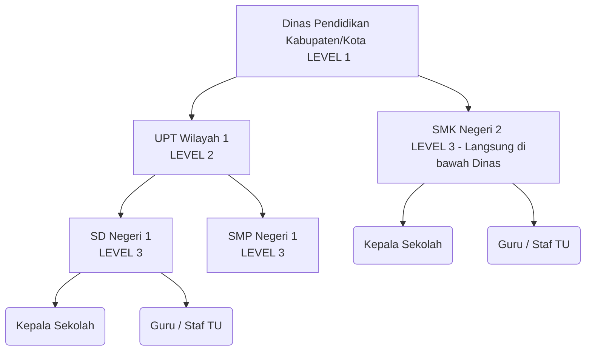

# 🏢 Penjelasan Hierarki Organisasi MAHESA

Sistem MAHESA (Manajemen HR & Pegawai) dirancang secara spesifik untuk mengakomodasi struktur organisasi yang ada pada sebuah **Dinas Pendidikan**, baik di tingkat Kabupaten maupun Kota.

Dokumen ini ditulis secara mendetail untuk memandu *programmer* junior atau *AI Assistant* dalam memahami bagaimana rancangan struktur organisasi ini berjalan dari sisi kode dan fitur.

---

## 🏛️ Struktur Pohon Organisasi (Tree Structure)

Secara garis besar, ekosistem pegawai di Dinas Pendidikan dibagi menjadi **Root (Induk)** dan **Cabang (Unit Kerja)**.



### 1. Dinas Pendidikan (Level 1)
Ini adalah tingkat teratas pengelola (`Admin Dinas`).
Secara database, entitas ini bertindak sebagai **Induk Utama**. Semua unit di bawahnya (baik UPT maupun Sekolah) wajib mencantumkan `id_dinas` ini.

### 2. UPT / Unit Kerja Pelaksana Teknis (Level 2)
Merupakan kepanjangan tangan dari Dinas Pendidikan untuk cakupan wilayah/kecamatan.
Secara arsitektur:
* Level 2 **selalu bernaung di bawah Level 1** (Dinas).
* Level 2 dapat mengelola/menaungi banyak Level 3 (Sekolah). Administrator pada UPT (`Admin Unit Kerja`) dapat diberi hak tambahan untuk memantau sekolah-sekolah di bawah gugus tugasnya.

### 3. Sekolah (Level 3)
Merupakan tingkatan terendah dalam struktur namun paling padat pegawainya (guru/staf).
Penting terkait relasi database (field `id_induk_unit`):
* Jika sebuah sekolah berada di bawah naungan UPT, maka **saat penambahan (add)** tabel sekolah (Level 3) ini akan menunjuk (*refer/assign*) ke UPT (Level 2) tersebut.
* Jika sebuah sekolah tidak berada di bawah UPT (misal: SMAN unggulan yang langsung dikoordinasi provinsi/pusat), maka bagian ini dibiarkan kosong (`id_induk_unit = NULL`), artinya ia berkoordinasi langsung dengan Level 1 (Dinas Pnedidikan).

---

## 👥 Sistem Peran (Role-Based Access Control)

Dalam sistem, ada **5 Peran Utama (Role)**. Masing-masing peran menentukan *platform* mana yang mereka gunakan dan seberapa luas otoritas mereka.

### 1. 🦸‍♂️ Admin Dinas (Akses Tertinggi)
* **Platform:** 🖥️ Web Dashboard
* **Siapa mereka:** Staf/Pegawai di Kantor Dinas Pendidikan Pusat.
* **Otoritas:** 
  * Memiliki akses tak terbatas ke data **seluruh Unit Kerja (semua sekolah)**.
  * Menambahkan/mengedit Master Data (Dinas, Unit Kerja).
  * Meninjau persetujuan akhir perubahan biodata pegawai.
  * Membuat pengumuman global ke seluruh unit kerja.
  * Pemantauan lokasi *Dinas Luar* (Pelacakan DL) secara real-time untuk **semua pegawai di seluruh kota**.

### 2. 🏢 Admin UPT (Operator Wilayah)
* **Platform:** 🖥️ Web Dashboard
* **Siapa mereka:** Operator pada Kantor UPT / Lingkup Wilayah Teknis.
* **Otoritas:**
  * Memantau dan merangkum rekapitulasi data **Sekolah (Level 3)** yang menunjuk (bernaung) pada UPT-nya.
  * Membantu memonitoring laporan Dinas Luar (DL) skala kawasan/wilayah mereka.

### 3. Solusi Status Ganda & Jembatan Multi-Admin

Dalam kasus dunia nyata, sering terjadi:
1. Sebuah tata usaha (Level 2/3) memiliki **lebih dari 1 Admin/Operator**.
2. **Budi** terdaftar secara fisik sebagai Guru (Level 3 / Sekolah), namun ia ditunjuk juga menjadi salah satu operator/admin bagi **UPT (Level 2)** yang menaungi wilayahnya.

Untuk menjaga struktur "Budi absen di SDN 1 Cibinong" tetap murni (berbasis GPS harian) namun memberikan hak "Web Dashboard UPT" kepadanya tanpa menjejali tabel `unit_kerja`, kita menggunakan tabel relasi perantara **`akses_admin_unit`**:
* Tabel `akses_admin_unit` menghubungkan `id_unit_kerja` dengan *banyak* `id_pegawai`.

**Cara Kerja Mesin:**
* Admin Dinas memasukkan data (Insert) ke tabel `akses_admin_unit`, memetakan UPT Cibinong (Level 2) dengan ID Pegawai milik Budi. 
* Saat Budi absen pagi hari via *Mobile App*, sistem menganggap ia adalah **Pegawai fisik biasa** yang bertugas dan wajib absen di kordinat SDN 1 Cibinong.
* Di sisi lain, saat Budi membuka komputer dan melakukan login *Web Dashboard*, keamanan (Middleware API) menyadari ID Pegawai Budi tercantum di dalam relasi `akses_admin_unit` untuk UPT tersebut. Budi pun disajikan data pelaporan sekolah khusus dari wilayah kekuasaan UPT-nya.

### Kesimpulan Multi-Admin
Admin Dinas tidak perlu membuat relasi rumit. Cukup tempatkan seorang pegawai di Unit Kerja asalnya (tempat dia berkantor fisik & wajib absen GPS). Jika ia ditugaskan menjadi operator administratif ganda (untuk sekolahnya, atau bahkan untuk UPT di atasnya), cukup tambahkan riwayat namanya ke dalam tabel jembatan `akses_admin_unit`.

### 4. 👑 Pimpinan Unit Kerja & Pejabat Struktural (Kepala Sekolah / PLT)
* **Platform:** 📱 Mobile App
* **Siapa mereka:** Pucuk pimpinan (Definitif atau PLT) yang tercatat aktif memimpin dalam tabel susunan **`pejabat_unit_kerja`**.
* **Otoritas:**
  * Fokus utamanya adalah **Persetujuan (Approval)** dan **Memantau Kehadiran**.
  * Berhak melakukan **Input Absensi Manual** (mengabsenkan bawahan) jika bawahannya terkendala (tanpa kewajiban validasi GPS/Selfie).
  * Mereka yang berhak menekan tombol "Setuju" atau "Tolak" saat bawahannya mengajukan: **Cuti, Dinas Luar (DL), dan Laporan Kinerja Harian**.
  * Lewat HP mereka, pimpinan ini bisa memantau "Hari ini siapa yang belum datang?" atau "Guru A posisinya sedang Dinas Luar dimana sekarang?".
  * Mengatur master *Jenis Kegiatan LHKP* untuk unit-nya, lalu **menugaskannya** ke masing-masing guru sesuai tanggung jawab mereka.

### 5. 👨‍🏫 Pegawai (Guru / Staf Administratif)
* **Platform:** 📱 Mobile App
* **Siapa mereka:** Guru pengajar, staf TU, dsb.
* **Otoritas (Akses Paling Terbatas):**
  * Hanya mengelola data **miliknya sendiri**.
  * Wajib absen *Clock-in* & *Clock-out* setiap hari dengan deteksi kordinat GPS dan Kamera Selfie.
  * Membuat Laporan Kinerja Harian secara mandiri dari *smartphone*.
  * Mengajukan Cuti atau izin Dinas Luar (*menunggu approval pimpinan*).
  * Sesekali mereka dapat memberikan "Peer Review" (Ulasan Penilaian) secara anonim kepada guru sejawat (teman se-sekolah).

---

## 🔄 Alur Persetujuan (Approval Flow)

Agar *AI Developer* atau *Junior Programmer* mudah memahami aturan *business logic*:

* **Cuti, Dinas Luar, & Kinerja:** 
  Hanya berputar di dalam sekolah itu sendiri.
  `Pegawai` mengajukan ➡️ diverifikasi dan dinilai oleh `Pimpinan Unit Kerja`.
* **Perubahan Biodata Pegawai (Sistem Berjenjang):** 
  Karena data ini krusial (seperti NIP, Rekening, dll), flow-nya wajib eskalasi bertingkat ke atas:
  - **Skenario A (Sekolah Level 3 di bawah UPT):**
    `Pegawai` ➡️ Setuju `Pimpinan Unit Kerja` ➡️ Setuju `Admin UPT` ➡️ Finalisasi `Admin Dinas`.
  - **Skenario B (Sekolah Level 3 langsung di bawah Dinas):**
    `Pegawai` ➡️ Setuju `Pimpinan Unit Kerja` ➡️ Finalisasi `Admin Dinas`.
  - **Skenario C (Pegawai/Admin di UPT Level 2):**
    `Pegawai UPT` ➡️ Setuju `Admin UPT / Pimpinan UPT` ➡️ Finalisasi `Admin Dinas`.
* **Laporan Kinerja Harian (LHKP):**
  Ini dinamis. `Pimpinan` membuat "Master Daftar Pekerjaan" dulu. ➡️ Lalu `Pimpinan` menempelkan tugas A, B, C ke `Guru A`. ➡️ Barulah `Guru A` di HP-nya bisa absen dan membuat laporan bahwa hari ini ia sudah mengerjakan pekerjaan A, B, C.

## 💾 Representasi Database Secara Singkat

```sql
dinas (Tabel 1 / Level 1)
  | 
  |--- unit_kerja (Tabel 2, banyak cabang)
         |
         |--- pegawai (Tabel 3, banyak pegawai per unitnya)
         |
         |--- (Tabel Mapping & Modul Baru Tipe N:M)
               > akses_admin_unit : Siapa saja tu/operator di unit ini?
               > pejabat_unit_kerja : Siapa Kepsek Definitif/PLT saat ini?
```

Dengan desain di atas, keamanan (multi-tenant per unit kerja) harus di filter selalu menggunakan relasi `id_unit_kerja` pada Drizzle/PostgreSQL! Jangan sampai *Admin Unit Kerja A* mengget data dari *Unit Kerja B*.
